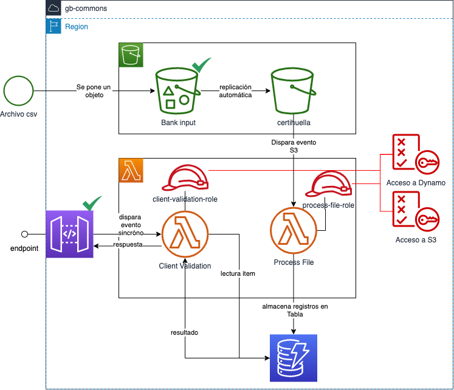

# spike-certihuella

Diagrama esquematico de la PoC:



Descripción: 

*Carga/Sincronización*

1. Un agente sube un archivo al bucket de entrada, de este se replica al bucket de operaciones (la configuración de la replicación y la ruta se hace a través de terraform)

2. Cuando el archivo se replica, dispara un evento asincrono hacia la lambda "process file".

3. La lambda "process file" interpreta el archivo y realiza una sincronización de la información con la base de datos (tabla en dynamoDB).

*Consulta/Validación*

1. Un agente valida la información de un cliente a través de un API REST. 

2. API Gateway dispara un evento sincrono hacia la lambda "client validation"

3. La lambda "client validation" ejecuta una consulta hacia la tabla de dyanamo y retorna la respuesta al cliente.


Dudas: 

1. ¿Cuál va a hacer el ciclo de vida de los archivos subidos en el bucket de operaciones? (tiempo de retención, que pasa una vez se sincronice con la base de datos, los datos se encripatrán en este bucket) 
2. ¿En que ruta el agente de certihuella va a subir los archivos? ¿Qué formato tienen los archivos (.csv, .xlsx, .xls)?
3. ¿Cuantos elementos tienen los archivos en promedio, que columnas tiene?
4. ¿Es posible que lleguen datos repetidos en los archivos, datos ya registrados? ¿hay algún mecanismo de actualización de los datos en la base de datos? 
5. ¿Los datos en la base de datos deben estar encriptados (Es información sensible) ya vienen encriptados?
6. ¿Cuál va a ser el mecanismo de seguridad para el endpoint del servicio de validación (OAuth con JWT por ejemplo)?
7. ¿Bajo que metricas se va a medir el rendimiento del sistema (peticiones/segundo para consulta) (archivos procesados/hora, minuto, saturación uso de recursos replicas)?
8. ¿Qué estrategía se va a manejar para el manejo de erroes de carga, sincronización de datos, erroes de la api? 
9. ¿Comó es el request y el response del API Client Validation?


Las lambdas son construidas utilizando Java y el framewor de inyección de dependencias [Google Guice](https://github.com/google/guice/wiki/Motivation)

Para realizar las pruebas locales:

1. Garantice que tiene instalado [AWS SAM](https://medium.com/@altaf.shaikh2963/how-to-build-run-and-debug-aws-lambda-function-locally-using-aws-sam-cli-bfaea8ff9cb7)

```sh
echo '{"lambdaName": "value1" }' | sam local invoke "lambdaClientValidation" --event - --debug --profile "default"  
echo '{"lambdaName": "value1" }' | sam local invoke "lambdaProcessFile" --event - --debug --profile "default"  
```